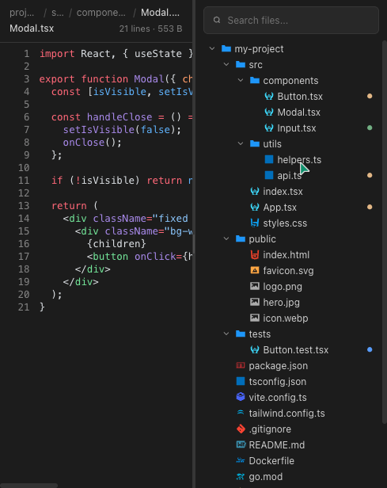

# kaying-filetree

[](https://github.com/kaying-studio/kaying-filetree/actions/workflows/ci.yml)
[](https://www.npmjs.com/package/@kayingai/kaying-filetree)
[](LICENSE)

[English](README.md) · [简体中文](README.zh-CN.md)

A file tree + code preview Web Component built for **custom AI agent interfaces**, fully benchmarked against the right-side file preview panel in **ChatGPT Codex**.

Designed around the agent workflow: present a browsable project structure on one side and rich file previews on the other, so your agent can show, explain, and let users inspect code, configs, images, and more — directly inside the conversation.



## Built for agents

- **Codex-style side panel** — draggable split view with the file tree on the right and the preview on the left, just like ChatGPT Codex.
- **Agent-native interactions** — copy selection, **add to agent**, Google search, plus an extensible context menu for custom agent actions.
- **No framework lock-in** — standard Web Component with Shadow DOM; drops into React, Vue, Svelte, Angular, or vanilla HTML.
- **Rich file preview** — syntax highlighting via [Shiki](https://shiki.style/), line numbers, breadcrumbs, image preview, and file metadata.
- **Production-grade tree** — virtual scrolling, search/filter, keyboard navigation, 50+ file-type icons, and Git status indicators.
- **Theme aware** — light, dark, or system mode via `--trees-*` CSS variables.

## Installation

```bash
npm install @kayingai/kaying-filetree
# or
pnpm add @kayingai/kaying-filetree
# or
yarn add @kayingai/kaying-filetree
```

## Quick Start

### Vanilla HTML

```html
<script type="module">
  import '@kayingai/kaying-filetree';
</script>

<agent-file-explorer
  id="explorer"
  theme="dark"
  shiki-theme="github-dark"
  style="width: 100%; height: 100vh;"
></agent-file-explorer>

<script type="module">
  const explorer = document.getElementById('explorer');

  explorer.tree = {
    id: 'root',
    name: 'project',
    path: '/project',
    isDirectory: true,
    children: [
      {
        id: 'src/index.ts',
        name: 'index.ts',
        path: '/project/src/index.ts',
        isDirectory: false,
      },
    ],
  };

  explorer.addEventListener('agent-file-open', (e) => {
    const { path, node } = e.detail;
    // load file content from your backend / filesystem
    const content = `// content of ${node.name}`;
    explorer.setFileContent(node.name, content, null, path, content.length);
  });
</script>
```

### React

```tsx
import '@kayingai/kaying-filetree';
import { useRef, useEffect } from 'react';

function FileExplorer({ tree }) {
  const ref = useRef(null);

  useEffect(() => {
    if (!ref.current) return;
    ref.current.tree = tree;
    ref.current.addEventListener('agent-file-open', (e) => {
      const { node, path } = e.detail;
      // load content
      ref.current.setFileContent(node.name, '// content', null, path, 10);
    });
  }, [tree]);

  return (
    <agent-file-explorer
      ref={ref}
      theme="dark"
      shiki-theme="github-dark"
      style={{ width: '100%', height: '100vh' }}
    />
  );
}
```

## API

### `<agent-file-explorer>`

| Property | Type | Default | Description |
|----------|------|---------|-------------|
| `tree` | `FileNode \| null` | `null` | Root node of the file tree. |
| `theme` | `'light' \| 'dark' \| 'system'` | `'dark'` | Color theme. |
| `shikiTheme` | `string` | `'github-dark'` | Shiki highlighting theme. |
| `splitRatio` | `number` | `0.5` | Initial ratio of the left (preview) panel. |
| `virtualized` | `boolean` | `true` | Enable virtual scrolling. |
| `showGitStatus` | `boolean` | `true` | Show Git status dots. |

| Method | Description |
|--------|-------------|
| `setFileContent(filename, content, imageUrl?, path?, size?)` | Display a file in the preview panel. |
| `expandAll()` | Expand all directories. |
| `collapseAll()` | Collapse all directories. |

| Event | Detail | Description |
|-------|--------|-------------|
| `agent-file-open` | `{ node: FileNode, path: string }` | Fired when a file is selected. |
| `agent-add-to-context` | `{ text: string, filename: string }` | Fired from the context menu "Add to agent". |

### `<agent-file-tree>`

Can be used standalone for just the file tree.

### `<agent-file-preview>`

Can be used standalone for just the code preview.

| Property | Type | Description |
|----------|------|-------------|
| `filename` | `string` | File name for language detection. |
| `content` | `string` | File text content. |
| `imageUrl` | `string \| null` | URL for image preview. |
| `filePath` | `string` | Full path for breadcrumb. |
| `fileSize` | `number \| null` | File size in bytes. |
| `extraContextMenuActions` | `ContextMenuAction[]` | Custom context-menu actions. |

## Themes

The component uses `--trees-*` CSS custom properties. Override them on the host element to customize:

```css
agent-file-explorer {
  --trees-bg: #0d1117;
  --trees-fg: #c9d1d9;
  --trees-accent: #58a6ff;
}
```

## Development

```bash
# install dependencies
npm install

# start dev server
npm run dev

# type check
npm run typecheck

# build
npm run build
```

## Contributing

Contributions are welcome! Please open an issue or submit a pull request. Make sure `npm run typecheck` and `npm run build` pass before submitting.

## License

[MIT](LICENSE) © Kaying Studio
